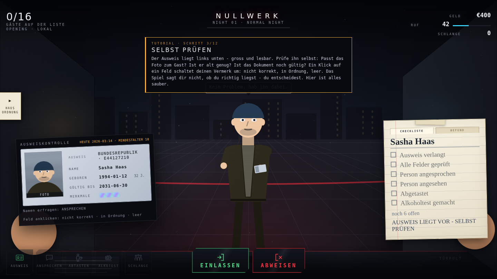
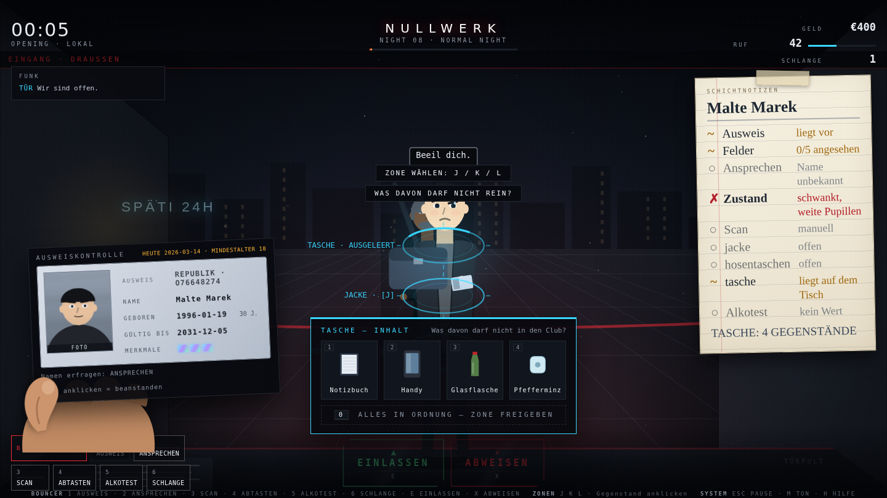
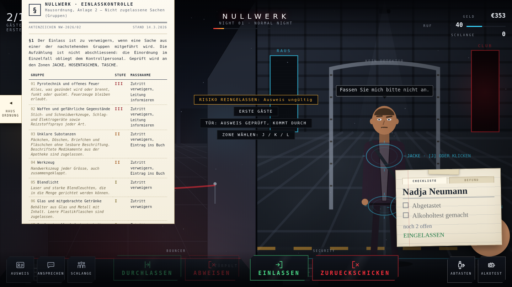

# NULLWERK — NIGHTSHIFT: BOUNCER CO-OP

Ein **2D-Simulationsspiel aus Sicht des Türstehers** eines fiktiven Underground-Techno-Clubs.
Du siehst die Strasse, die Schlange und den Gast direkt vor dir. Er reicht dir seinen Ausweis —
und du prüfst ihn **selbst**: Foto gegen Gesicht, Name gegen Aussage, Geburtsdatum gegen heute,
Ablaufdatum, Hologramm. Dann entscheidest du.

**Das Spiel zeigt dir nichts an.** Es markiert keine Auffälligkeit, piept nicht und hakt
nichts für dich ab. Was nicht der Norm entspricht, trägst du selbst ein — auf dem Ausweis,
auf dem Kontrolltisch und auf deinem Notizblock. Abgerechnet wird erst am Ende der Nacht,
und jede zutreffende Beanstandung bringt Geld.

Spielbar **allein**, zu zweit **an einer Tastatur** (Splitscreen) oder **online über einen Raumcode**.

**Das Spiel ist 2D.** Frontansicht mit Tiefenstaffelung, alles prozedural auf Canvas gezeichnet —
kein 3D, keine Ego-Kamera, keine Assets.



Der Ausweis liegt in deiner Hand, die Checkliste hängt als Notizzettel daneben,
und was aus einer Tasche kommt, landet gross auf dem Kontrolltisch:



Am linken Rand fährt die Hausordnung aus — ein amtliches Schreiben mit allem, was
nicht in den Club darf:



---

## Starten

```bash
npm install     # nur für den Online-Modus nötig (ws)
npm start       # http://localhost:8080 — inkl. Online-Räume
```

Ohne Online-Koop genügt jeder statische Server (`npm run serve:static`).

## Tests

```bash
npm test            # Headless: Solo-Nacht, Koop-Nacht, Tutorial, Ausweisregeln, Save/Load
npm run test:browser  # Chromium: spielt alle drei Modi durch, inkl. echtem Online-Raum
npm run shots       # dasselbe mit Screenshots nach docs/
```

Der Browser-Check startet den echten Server, öffnet **zwei** Fenster, erstellt einen Raum,
tritt ihm bei und spielt Tür und Schleuse gegeneinander — Online-Koop wird also wirklich getestet,
nicht nur behauptet.

---

## Die drei Modi

| | Wer macht was | Ansicht |
|---|---|---|
| **SOLO** | Du machst Tür **und** Kontrolle. Es gibt keinen Security-Bereich. | Eine Ansicht: die Tür |
| **LOKALER KOOP** | Zwei Spieler, eine Tastatur. | Splitscreen: links Tür, rechts Schleuse |
| **ONLINE-KOOP** | Raum erstellen / mit Code beitreten. Host = Bouncer, Gast = Security. | Jeder sieht seinen Bereich |

## Die zwei Bereiche

```
Strasse → [ TÜR — draussen ]        → [ SCHLEUSE — innen ]        → Club
           Bouncer:                     Security:
           Ausweis, Gespräch,           Abtasten, Alkoholtest,
           Schlange beruhigen           Gegenstände prüfen
           DURCHLASSEN / ABWEISEN       EINLASSEN / ZURÜCKSCHICKEN
```

Der **Bouncer arbeitet draussen** und entscheidet nur, wer überhaupt hineindarf.
Die **Security sitzt drinnen in einer Sicherheitsschleuse** — innen, aber vom Club getrennt;
erst sie öffnet die Tür zum Floor. Im Solo-Modus entfällt die Schleuse komplett.

Daraus entsteht das eigentliche Koop-Gefühl: eine **zweite Verteidigungslinie**.
Was der Bouncer übersieht, kann die Security noch fangen — das gibt einen **guten Fang**
(Bonus fürs Team) statt einer Strafe. Stimmt das Urteil der Tür mit dem Befund der Schleuse
(Abtasten + Alkoholtest) überein, gibt es **SECURITY VERIFIED** (+15 % Eintritt, mehr Ruf);
widersprechen sie sich: **CHECK AGAIN**. Solo zählt stattdessen, ob wirklich alles
geprüft wurde.

## Steuerung

**Solo**
`1` Ausweis · `2` Ansprechen · `3` Abtasten · `4` Alkotest · `5` Schlange ·
`E` Einlassen · `X` Abweisen · Zonen `J` `K` `L` oder Ring anklicken · Gegenstand: anklicken oder `1`–`6`, `0` = Zone freigeben

**Koop — Spieler 1 (Bouncer, draussen)**
`1` Ausweis · `2` Ansprechen · `3` Schlange · `E` Durchlassen · `X` Abweisen

**Koop — Spieler 2 (Security, Schleuse)**
`7` Abtasten (Zonen `J` Jacke / `K` Hosentaschen / `L` Tasche, oder Ring anklicken) · `8` Alkotest ·
`ENTER` Einlassen · `BACKSPACE` Zurückschicken

Abwehr (wenn jemand auf dich losgeht): `Q` `W` `E` `R` `A` `S` `D` `F` — es erscheint immer
genau die Taste, die als Nächstes sitzen muss; anklicken geht auch.

System: `ESC` Pause · `M` Ton · `H` Hilfe

Einlassen und Abweisen liegen als grosse Buttons unten in der Bildmitte — Maus oder Taste.
Die Auswahl auf dem Kontrolltisch, die Ausweisfelder und die Abtast-Ringe am Gast laufen
über die Maus (im Solo zusätzlich über die Zifferntasten).

Der Titelbildschirm zeigt die Szene, um die es geht — Clubfassade, Schlange, Türsteher —
und stellt die Auswahl als Spalte rechts daneben: Spielname oben, darunter Solo, lokaler
Koop, Online-Koop sowie Einstellungen, Anleitung und Über das Spiel.

## Die Kontrolle

Der Ausweis liegt gross und lesbar unten links. **Jeder Klick auf ein Feld schaltet deinen
eigenen Vermerk um: *nicht korrekt* → *in Ordnung* → leer.** Das Spiel verrät nichts von
selbst und sagt dir auch nicht, ob du richtig liegst — du musst hinsehen:

| Feld | Wie du es prüfst |
|---|---|
| **Foto** | Gegen das Gesicht des Gastes im Bild. Hautton, Haare, Gesichtsform. |
| **Name** | Gegen das, was der Gast beim *Ansprechen* sagt. |
| **Geburtsdatum** | Alter am heutigen Spieldatum. Manipulierte Ziffern sitzen schief. |
| **Gültig bis** | Gegen das heutige Datum oben auf der Karte. |
| **Merkmale** | Drei Hologramm-Marken. Matt oder fehlend = gefälscht. |

Die Felder färben sich nach **deiner** Angabe: grün für *in Ordnung*, rot für *nicht korrekt*.
Ob das stimmt, erfährst du erst nach der Entscheidung — Hinweise, Warntöne oder markierte
Felder gibt es nicht mehr, auch nicht durch Upgrades. Die Ausrüstung macht dich nur schneller.

**Jede zutreffende Beanstandung ist bares Geld.** Am Ende der Nacht rechnet der Bericht ab,
was du selbst gefunden hast, was du zu Unrecht beanstandet und was du übersehen hast.
Wer genau hinsieht, verdient mehr.

### Abtasten und Gegenstände

Beim Abtasten wählst du eine Zone: **J** Jacke, **K** Hosentaschen, **L** Tasche.
Eine Tasche gibt es nur, wenn der Gast wirklich eine dabei hat — dann siehst du sie an
seiner Schulter, und er holt sie erst hervor, bevor der Prüfring erscheint.

Der Inhalt kommt gross auf den Kontrolltisch: Kaugummi, Schlüssel, Ladekabel — und
vielleicht ein Schlagring, ein Briefchen ohne Beschriftung oder eine Bengalfackel. **Du**
markierst, was nicht in den Club darf (nochmal klicken nimmt die Markierung zurück), und
schliesst die Zone dann ab. Ob du richtig lagst, sagt dir hier niemand — das steht erst
im Bericht.

Es gibt rund 50 verschiedene Sachen, gut die Hälfte davon verboten: allein bei den Waffen
liegen mal ein Klappmesser, mal ein Butterflymesser, mal ein Schlagring, ein Elektroschocker
oder ein Teleskopschlagstock auf dem Tisch. Ein paar Paare sind mit Absicht knapp
auseinander: beschriftete Schmerztabletten sind in Ordnung, das Döschen mit losen Pillen
nicht; ein Deoroller ja, Reizgasspray nein; ein Feuerzeug ja, Wunderkerzen nein.

### Die Hausordnung

Am linken Bildrand klebt ein Pfeil. Fährst du mit der Maus darüber, klappt die Hausordnung
aus: ein amtliches Schreiben mit Briefkopf, Aktenzeichen und Stempel, das Paragraph für
Paragraph auflistet, was nicht in den Club darf, welche Stufe es hat und was zu tun ist.

Sie nennt dabei **nur Gruppen** — Waffen, Pyrotechnik, unklare Substanzen, Werkzeug, Glas
und mitgebrachte Getränke, professionelle Aufnahmetechnik, Blendlicht — und ausdrücklich
keine einzelnen Gegenstände. Ob der Schlagring in der Hosentasche eine Waffe ist und ob
das Fläschchen ohne Etikett unter "unklare Substanzen" fällt, entscheidest du. Abgelesen
werden kann die Kontrolle nicht.

### Alkohol und Zustand

Der Alkoholtest legt ein Gerät auf den Tisch. Der Wert **zählt von 0 hoch**, während gemessen
wird, und bleibt dann stehen. Das Gerät zeigt **nur die Zahl** — der Grenzwert steht daneben
aufs Gehäuse gedruckt. Die Bewertung machst du.

Und ein niedriger Promillewert heisst nicht, dass jemand nüchtern ist: ab der vierten
Nacht kommen Gäste, denen man es **von aussen ansieht** — gerötete Augen, weite Pupillen,
ein glasiger Blick, dunkle Augenringe, fahle Haut, Schweiss auf der Stirn, mahlender
Kiefer, zittrige Hände, jemand, der keine Sekunde stillsteht. Alles davon wird an der
Figur wirklich gezeichnet, auch schon in der Schlange: wer hinsieht, weiss vorher, wer
gleich vor ihm steht. Das steht in keiner Anzeige — das siehst du der Person an oder eben
nicht. Später werden die Anzeichen subtiler.

### Wenn jemand ausrastet

Selten — bei etwa jedem vierzigsten Gast, ab Nacht 5 — nimmt jemand ein "Nein" nicht hin.
Er kommt auf dich zu, wird im Bild gross, und mitten auf dem Schirm erscheinen
nacheinander Tasten (`Q` `W` `E` `R` `A` `S` `D` `F`), jede mit einem schrumpfenden
Zeitring. Drei bis fünf davon musst du treffen, bevor die Zeit abläuft; zwei Fehlgriffe
verzeiht die Abwehr, den dritten nicht. Wer lieber mit der Maus spielt, klickt die
eingeblendete Taste an — beides zählt gleich.

Solange das läuft, ist alles andere gesperrt: keine Kontrolle, keine Entscheidung, nur
Reaktion. Gelingt die Abwehr, fliegt er raus, es gibt Ruf und eine Prämie. Gelingt sie
nicht, kostet das Geld und Ruf, und du stehst danach zwei Sekunden benommen da. Abgewiesen
wird er in beiden Fällen — wer handgreiflich wird, hat dir die Entscheidung abgenommen.

Ob jemand ausrastet, hängt an ihm: betrunken, unter Einfluss, gereizt und riskant heisst
deutlich explosiver als ein entspannter Stammgast. Der Bericht zählt am Ende der Nacht,
wie oft es passiert ist und wie oft du es abgewehrt hast.

### Der Notizzettel — zwei Seiten, beide deine

Unten rechts hängt kein HUD-Panel, sondern ein handgeschriebener Block mit zwei Reitern:

* **Seite 1 — Checkliste.** Was bei diesem Gast noch zu prüfen ist. Du hakst selbst ab;
  das Spiel setzt keinen einzigen Haken für dich.
* **Seite 2 — Befund.** Dokument, Zustand der Person, mitgeführte Sachen, Alkoholwert.
  Ein Klick auf eine Zeile trägt ein: *entspricht der Norm* → *entspricht nicht* → leer.

Belegung des Clubs, Ausbaustufe und die alte Übersichtskarte gibt es im Spiel nicht mehr —
während der Schicht zählt nur, was auf dem Zettel steht. Und was dort steht, hast du
selbst geschrieben.

### Die Schicht statt der Uhr

Es gibt keinen Tages-Timer mehr. Oben links steht, **wie viele Gäste heute auf der Liste
stehen** — 16 in der ersten Nacht, mit jeder weiteren zwei mehr, gedeckelt bei 40. Sind sie
abgearbeitet, ist Feierabend. Du kannst dir also Zeit lassen: Gründlichkeit kostet dich
keine Sekunde Schicht, nur die Geduld der Leute in der Schlange.

## Was mit der Zeit dazukommt

Jede Karriere fängt einfach an und wird schrittweise gemeiner. Was neu dazukommt,
kündigt das Briefing vorher an:

| ab Nacht | Neu | Worauf du achtest |
|---|---|---|
| 1 | Ausweis | Foto, Name, Geburtsdatum, Gültigkeit, Hologramm |
| 2 | Gegenstände | Beim Abtasten kommt alles auf den Tisch |
| 3 | Alkohol | Das Gerät zeigt den Wert, den Grenzwert liest du ab |
| 4 | Zustand | Sichtbare Anzeichen für Substanzeinfluss |
| 5 | Übergriffe | Manche gehen auf dich los — Tasten treffen |
| 6 | Feine Fälschungen | Subtilere Manipulationen |
| 8 | Hausverbote | Bekannte Gesichter versuchen es erneut |
| 10 | Mehrfache Mängel | Es kommt oft mehreres zusammen |

Zusätzlich liegen später mehr harmlose Gegenstände zur Ablenkung dabei.

## Tutorial

Eine ruhige erste Schicht in **12 Schritten**, die jede Mechanik mit genau einem passenden
Gast einführt — und sie erst dann freischaltet: erster Gast → Ausweis verlangen → selbst prüfen →
entscheiden → abgelaufenes Dokument → zu jung → *Ansprechen* freigeschaltet (Namensabgleich) →
Fotovergleich → Hologramm → Abtasten/Alkotest (bzw. die Schleuse im Koop) →
Schlange beruhigen → freier Betrieb. Abwählbar im Menü.

---

## Was sonst drin ist

* **Gäste** mit versteckten Eigenschaften, 10 Archetypen, sechs Persönlichkeiten mit eigenen
  Sprüchen, sichtbarem Schwanken und Gesichtsausdruck.
* **Wirtschaft**: Eintritt (skaliert mit Ruf und Ausbaustufe), laufender Bar- und VIP-Umsatz,
  Bussgelder, Zwischenfallkosten, Gagen.
* **Reputation 0–100** steuert Andrang, Preise, VIP-Anteil und verfügbare Acts.
* **13 Upgrades** in 5 Bereichen und 7 Club-Stufen. Der Ausbau zeigt sich dort, wo du stehst:
  breitere Tür, hellere Neonschrift, Detektorbogen in der Schleuse, Kameras, VIP-Eingang.
* **Nacht-Events** (Rave, VIP Night, Artist Night, Sold Out, Inspection, Chaos) und
  **Zufallsereignisse** (Stromausfall, defektes Prüfgerät, Ansturm, viraler Post, falscher Backstage-Pass …).
* **Acts buchen** — fiktive Künstler; auch der Headliner braucht einen Ausweis.
* **Night Report**, 6 Ränge, 5 Talente, Save-System (`localStorage`).
* **Prozeduraler Techno** (WebAudio, kein Asset), dessen Intensität Nachtphase und
  Schlangenlänge folgt, plus Mess-, Signal- und Türsounds.

---

## Architektur

Spiellogik ist DOM-frei und damit headless testbar — und läuft im Online-Modus
unverändert autoritativ beim Host.

```
index.html            Shell + HUD-Markup
styles/ui.css         UI: dunkel, industriell, minimal
src/main.js           Modi, Spielfluss, Eingaben, Host/Gast-Verdrahtung

src/core/             rng · bus · input · loop · audio
src/data/             config (Modi, Rollen, Balancing) · dialogue
src/systems/          state · guests · queue · identity · security · alcohol · notes
                      decision · economy · reputation · upgrades · artists · randomEvents
                      nightcycle · progression · difficulty · tutorial · coop · save
                      aggression (Übergriffe und Tastenabwehr)
src/render/           layout · palette · sprites · figure (grosse Frontfiguren)
                      items (gezeichnete Gegenstände) · scene (Tür-/Schleusenansicht,
                      Abtast-Ringe, Alkoholtestgerät) · title (Titelbildschirm)
                      effects · renderer
src/ui/               hud (inkl. Entscheidungs-Buttons) · notepad (Block mit zwei Seiten)
                      idcard (Ausweis in der Hand) · itemtray (Kontrolltisch)
                      rulebook (ausfahrende Hausordnung am linken Rand)
                      report · shop · screens
src/net/net.js        Räume, Schnappschüsse, Aktionen
server/index.js       Statischer Server + WebSocket-Raumvermittlung
tests/                smoke.mjs (headless) · browser-check.mjs (Chromium, alle drei Modi)
```

**Online-Modell:** Host-autoritativ. Der Host simuliert die Nacht und schickt ~12×/s einen
Schnappschuss; der Gast rendert daraus seine Schleusen-Ansicht und schickt nur Aktionen zurück.
Der Server kennt keine Spielregeln — er verbindet zwei Clients und leitet Nachrichten weiter.
Die versteckte Wahrheit über Gäste bleibt beim Host und wird nie mitgeschickt.

## Balancing anpassen

Fast alles Spürbare steht in `src/data/config.js`: `TUNING` (Nachtlänge, Aktionsdauern, Geduld,
Preise, Mindestalter), `rolesFor(mode)` (Tastenbelegung und Bereiche), `GAME_DATE` (das Datum,
gegen das geprüft wird), `ARCHETYPES`, `ITEMS`, `NIGHT_EVENTS`, `UPGRADES`, `ARTISTS`,
`RANKS`, `TALENTS`, `ITEMS` (was Gäste dabeihaben) samt `ITEM_CATEGORIES` (die Gruppen,
die in der Hausordnung stehen), `ZONES` (Abtast-Zonen),
`ALCOHOL_LIMIT_PROMILLE` (der aufgedruckte Grenzwert),
`DIFFICULTY_STEPS` (wann welche Auffälligkeit dazukommt), `IMPAIRMENT_SIGNS`
(die sichtbaren Anzeichen) sowie `AGGRESSION` und `DEFENSE_KEYS` (Häufigkeit, Zeitfenster
und Tasten der Abwehr).
Der Clubname ist eine Konstante (`CLUB_NAME`).

## Nächste Schritte

* Weitere Rollen: Floor Security, VIP Security, Backstage Security
* Gamepad-Support, Zuschauermodus für Online-Räume
* **EXPAND**: zweiter Club als zweite Spielphase (`expandUnlocked` ab Ruf 88 und Nacht 12)
