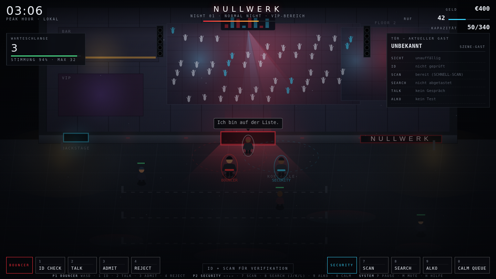

# NULLWERK — NIGHTSHIFT: BOUNCER CO-OP

Ein **2D-Top-Down-Koop-Simulationsspiel** über die Tür eines fiktiven europäischen
Underground-Techno-Clubs. Zwei Spieler an einer Tastatur: einer hält die Tür,
einer macht die Kontrolle. Gäste kommen, werden geprüft, rein- oder rausgelassen —
und der Club wächst sichtbar mit jeder Nacht.

**Das Spiel ist 2D.** Top-Down-Szene auf Canvas, animierte 2D-Figuren, Schatten,
Neon, Nebel, Partikel, bewegtes Licht. Kein 3D, keine Ego-Perspektive.



---

## Starten

Keine Build-Kette, keine Abhängigkeiten zur Laufzeit — reine ES-Module.

```bash
npm start          # http://localhost:8080
```

Alternativ genügt jeder statische Server (`python3 -m http.server`), weil ES-Module
nicht über `file://` geladen werden dürfen.

## Tests

```bash
npm test           # Headless-Simulation einer kompletten Nacht (ohne Browser)
npm run test:browser   # lädt das Spiel in Chromium, spielt Gäste ab, prüft auf Fehler
npm run shots      # dasselbe, schreibt Screenshots nach docs/
```

`npm test` simuliert eine ganze Nacht mit einer einfachen Türsteher-KI und prüft,
dass Warteschlange, Kontrollen, Entscheidungen, Wirtschaft, Reputation,
Koop-Verifikation, Upgrades und Save/Load tatsächlich funktionieren.

---

## Steuerung — zwei Spieler, eine Tastatur

| | Spieler 1 — **BOUNCER** | Spieler 2 — **SECURITY** |
|---|---|---|
| Bewegung | `W` `A` `S` `D` | `←` `↑` `↓` `→` |
| Aktionen | `1` ID CHECK · `2` TALK · `3` ADMIT · `4` REJECT | `7` SCAN · `8` SEARCH · `9` ALKO · `0` CALM QUEUE |
| Abtasten | — | `J` Jacke · `K` Taschen · `L` Beutel |

System: `P` Pause · `M` Ton an/aus · `H` Hilfezeile

Jede Aktion braucht Zeit (Fortschrittsbalken über der Figur) und funktioniert nur
an der eigenen Station — die Schlange wartet derweil nicht. `CALM QUEUE` wirkt
dort, wo die Schlange steht, nicht an der Tür.

### Koop-Spezialsystem

Prüfen **beide** Spieler denselben Gast (P1 macht ID CHECK, P2 macht SCAN):

* Ergebnisse stimmen überein → **SECURITY VERIFIED** (+15 % Eintritt, mehr Ruf)
* Ergebnisse widersprechen sich → **CHECK AGAIN** (Funkmeldung, nochmal prüfen)

Das belohnt Reden statt paralleles Vor-sich-hin-Klicken.

---

## Kern-Schleife

```
Gäste treffen ein → Schlange → Gast an der Tür
   → ID prüfen / scannen / abtasten / ansprechen / Alkoholtest
   → ADMIT oder REJECT
   → Geld & Reputation → Night Report → Upgrades → nächste Nacht
```

Jede Entscheidung hat einen Preis:

* **Riskanten Gast reinlassen:** Umsatz jetzt, evtl. Zwischenfall, Bußgeld, Rufverlust.
* **Sauberen Gast abweisen:** kein Risiko, aber verlorener Umsatz — bei VIPs und
  Influencern kostet es zusätzlich Ruf.
* **Minderjährige durchwinken:** teuerster Fehler im Spiel, in Inspection Nights doppelt.
* **Zu langsam sein:** Gäste verlieren Geduld und gehen. VIPs zuerst.

## Was drin ist

* **Gäste** mit versteckten Eigenschaften (Alter, Dokument, Betrunkenheit, Risiko,
  Gegenstände, VIP-Status, Ausgabeverhalten) und 10 Archetypen vom Stammgast bis
  zum Mystery-Gast — jeder mit eigener Persönlichkeit und eigenen Sprüchen.
* **Ausweiskontrolle** mit lesbarem Dokument: Name, Geburtsdatum, Ablaufdatum,
  Sicherheitsmerkmale, Foto. Fälschungen sind erkennbar — je nach Ausrüstung und Talent.
* **Scanner** in vier Stufen (manuell → digital → schnell → Risikoanalyse).
* **Körperliche Kontrolle** als abstraktes Zonen-Abtasten (drei Zonen, Signal statt
  Darstellung von Gewalt); Metalldetektor-Upgrades nehmen Handarbeit ab.
* **Alkohol- und Verhaltenscheck** als schnelle Entscheidung: Gespräch, sichtbares
  Schwanken, optionaler Test mit Zahlenwert.
* **Warteschlange** mit Geduld, Stimmung, Nachrücken und Abspringern.
* **Wirtschaft**: Eintritt (skaliert mit Ruf und Ausbaustufe), laufender Bar- und
  VIP-Umsatz der Gäste im Club, Bußgelder, Zwischenfallkosten, Gagen.
* **Reputation 0–100** steuert Andrang, Preise, VIP-Anteil und verfügbare Acts.
* **13 Upgrades** in 5 Bereichen, die die Szene **sichtbar** verändern: Tanzfläche
  wächst, zweiter Floor, VIP-Lounge, Backstage, Boxenstacks, Laser, LED, breitere
  Tür, VIP-Eingang, hellerer Schriftzug. 7 Club-Stufen vom Kellerclub zum Techno-Tempel.
* **Nacht-Events** (Normal, Rave, VIP Night, Artist Night, Sold Out, Inspection,
  Chaos) und **Zufallsereignisse** (Stromausfall, Scannerdefekt, Ansturm, Beschwerde,
  Promi, viraler Post, falscher Backstage-Pass, verspäteter Act).
* **Acts buchen** — fiktive Künstler mit Gage, Popularität, Genre. Der Running Gag:
  auch der Headliner steht am Hintereingang und braucht einen Ausweis.
* **Night Report** mit voller Bilanz, Sternewertung, Rufveränderung und XP.
* **Fortschritt**: 6 Ränge (Rookie → Club Manager), 5 Talente mit je 3 Stufen.
* **Save-System** über `localStorage` (Metaprogression, nicht die laufende Nacht).
* **Audio**: prozedurale Techno-Spur (WebAudio, kein Asset), deren Intensität der
  Nachtphase und der Schlangenlänge folgt, plus Scanner-, Funk- und Türsounds.

---

## Architektur

Alle Systeme sind getrennt; die Spiellogik ist DOM-frei und damit headless testbar.

```
index.html            Shell + HUD-Markup
styles/ui.css         UI: dunkel, industriell, minimal
src/main.js           Verdrahtung: Loop, Spielfluss, Screens

src/core/             rng · bus · input · loop · audio
src/data/             config (Balancing, Tabellen) · dialogue
src/systems/          state · guests · queue · identity · scanner · security
                      alcohol · decision · economy · reputation · upgrades
                      artists · events (randomEvents) · nightcycle · progression
                      coop · save
src/render/           layout · palette · sprites · effects · renderer
src/ui/               hud · panels · report · shop · screens
tools/serve.mjs       Dev-Server
tests/                smoke.mjs (headless) · browser-check.mjs (Chromium)
```

`src/render/layout.js` hält die Weltkoordinaten, die Rendering **und** Gameplay
teilen — Figuren und Kulisse können damit nicht auseinanderlaufen.

## Balancing anpassen

Fast alles Spürbare steht in `src/data/config.js`: `TUNING` (Nachtlänge,
Aktionsdauern, Geduld, Preise), `ARCHETYPES`, `ITEMS`, `NIGHT_EVENTS`,
`UPGRADES`, `ARTISTS`, `RANKS`, `TALENTS`. Der Clubname ist eine Konstante
(`CLUB_NAME`) und austauschbar.

## Nächste Schritte

* Netzwerk-Koop (aktuell lokaler Zwei-Spieler-Modus an einer Tastatur)
* Weitere Rollen: Floor Security, VIP Security, Backstage Security
* Gamepad-Support
* **EXPAND**: zweiter Club als zweite Spielphase (Freischaltung ist bereits im
  State vorbereitet: `expandUnlocked` ab Ruf 88 und Nacht 12)
